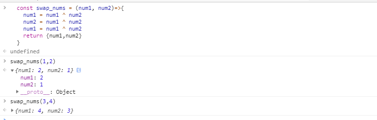

# js中的位操作符, ^ (按位异或)
收藏一下自己刷`leetcode`以及看博文发现的一些好的技巧. [但是基础还是数据结构和算法]

## 什么是位运算
    按位操作符（Bitwise operators） 将其操作数（operands）当作32位的比特序列（由0和1组成），而不是十进制、十六进制或八进制数值。例如，十进制数9，用二进制表示则为1001。按位操作符操作数字的二进制形式，但是返回值依然是标准的JavaScript数值。- MDN
<!--more-->

### `^`按位异或(XOR)
    对每一对比特位执行异或（XOR）操作。当 a 和 b 不相同时，a XOR b 的结果为 1。

异或操作真值表：

|   a   |   b   | a XOR b |
| :---: | :---: | :-----: |
|   0   |   0   |    0    |
|   0   |   1   |    1    |
|   1   |   0   |    1    |
|   1   |   1   |    0    |
> 将任一数值 x 与 0 进行异或操作，其结果为 x。将任一数值 x 与 -1 进行异或操作，其结果为 ~x。

- MDN
  ```
  9 (base 10) = 00000000000000000000000000001001 (base 2)
      14 (base 10) = 00000000000000000000000000001110 (base 2)
                     --------------------------------
  14 ^ 9 (base 10) = 00000000000000000000000000000111 (base 2) = 7 (base 10)
  ```
- e.g
  ```js
  const swap_nums = (num1, num2)=>{
    num1 = num1 ^ num2
    num2 = num1 ^ num2
    num1 = num1 ^ num2
    return {num1,num2}
  }

  ```
  

### 找出没有重复的数
    给出一个数组已知其中的数只有一个不是重复的，其他都重复了2次。找出不重复的数字.
用例如下：
  ```js
  [1,2,1] // 输出 => 2
  [1,1,2,2,3] //输出 => 3
  ```
<!--more-->
#### 思路一
    用Object存储用元素作为Key Key存在则删除 最后直接获取`Object.keys(obj)[0]`

代码如下:
  ```js
    /**
   *  简单的使用HashMap来查询只出现一次的数据
   * @param {*} arr 
   */
  function singleNumber(arr = []) {
    const hashMap = {}
    for (const i of arr) {
      if (hashMap[i]) {
        delete hashMap[i]
      } else {
        hashMap[i] = 1
      }
    }
    return Object.keys(hashMap)[0]
  }
  ```

#### 思路二 
    使用按位异或（XOR）运算

代码如下:
  ```js  
  /**
   * 使用位运算
   * @param {*} arr 
   */
  function singleNumberBitXOR (arr = []) {
    let res = 0
    for (const i of arr){
      res ^= i
    }
    return res
  }
  ```

### XOR加密  
满足下面两个条件，XOR 加密是无法破解的。
* key的长度大于等于message
* key必须是一次性的，且每次都要随机产生

理由很简单，如果每次的key都是随机的，那么产生的CipherText具有所有可能的值，而且是均匀分布，无法从CipherText看出message的任何特征。也就是说，它具有最大的"信息熵"，因此完全不可能破解。这被称为 XOR 的"完美保密性"（perfect secrecy）。

满足上面两个条件的key，叫做 one-time pad（缩写为OTP），意思是"一次性密码本"，因为以前这样的key都是印刷成密码本，每次使用的时候，必须从其中挑选key。

```js
function encryptStringWithXORtoHex(text, secret) {
  while (secret.length < text.length) {
    secret += secret
  }
  return text
    .split('')
    .map((v, i) => (v.charCodeAt(0) ^ secret[i].charCodeAt(0)).toString('16'))
    .join('|')
}

function decryptHexStringWithXOR(encryptText, secret) {
  return encryptText
    .split('|')
    .map((v, i) => (String.fromCharCode(
      (parseInt(v, 16)) ^ secret.charCodeAt(i))))
    .join('')
}
// 当然我们不加16进制的转换会相对简单一些，这里只是想用一句代码实现，所以放弃了使用for循环 使用for循环效率会高很多。。。
```

## REF
1. [Bit Twiddling Hacks](http://graphics.stanford.edu/~seander/bithacks.html)
2. [bit-twiddle](https://github.com/mikolalysenko/bit-twiddle)
3. [【译】位运算的奇技淫巧：Bit Twiddling Hacks](https://blog.hufeifei.cn/2017/07/30/DataStructure/%E4%BD%8D%E8%BF%90%E7%AE%97%E7%9A%84%E5%A5%87%E6%8A%80%E6%B7%AB%E5%B7%A7/)
4. [关于一切位操作的魔法（上）](https://zhuanlan.zhihu.com/p/37014715)
5. [Bit Hacks：关于一切位操作的魔法（中）](https://zhuanlan.zhihu.com/p/37175153)