# Redis 数据结构的使用
## 使用`Docker`简单的运行一个单节点的`Redis server`
  ```
  docker run \
    -d \
    -p 6379:6379\
    --restart=always \
    --name redis \
    redis
  ```
  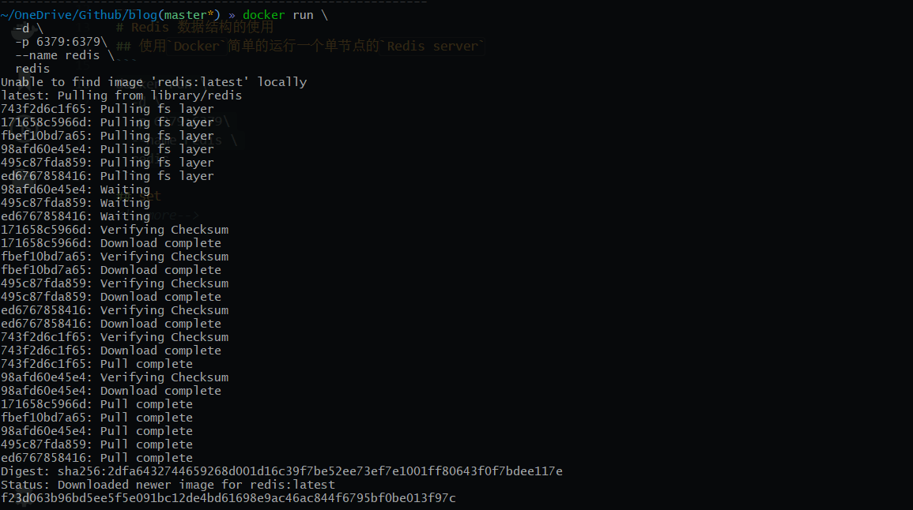
<!--more-->

## 使用`Redis`命令
1. 进入容器内部`docker exec -it redis bash`
2. 使用`redis-cli` 也可以加上 `-n: 选择不同的db`
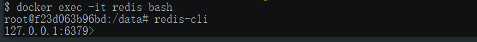
## String
   ```
   SET keyName Value
   ```
   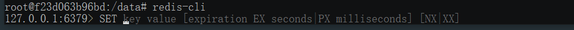
   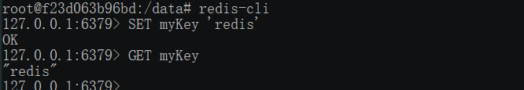

## List
    Redis列表是简单的字符串列表，按照插入顺序排序[**有序**]。
> 一个列表最多可以包含 232 - 1 个元素 (4294967295, 每个列表超过40亿个元素)。

## 使用
- 设置值
  ```
  LPUSH KEY value
  ```
  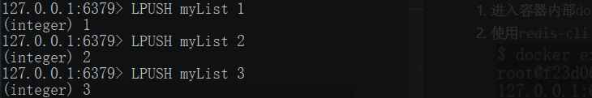

- 获取列表中的所有原始
  ```
  LRANGE KEY start stop
  ```
  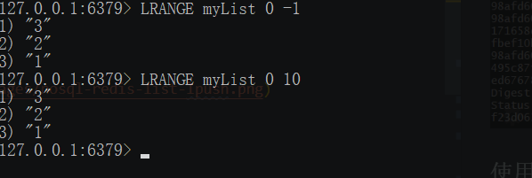

- `LINDEX key index`: 通过索引获取列表中的元素
- `LREM KEY_NAME COUNT VALUE`: 根据参数 COUNT 的值，移除列表中与参数 VALUE 相等的元素。
- `BLPOP key1 [key2 ] timeout`: 移出并获取列表的第一个元素， 如果列表没有元素会阻塞列表直到等待超时或发现可弹出元素为止。 
- `BRPOP key1 [key2 ] timeout`:  移出并获取列表的最后一个元素， 如果列表没有元素会阻塞列表直到等待超时或发现可弹出元素为止。
  
## Set
    Redis 的 Set 是 String 类型的无序集合。集合成员是唯一的，这就意味着集合中不能出现重复的数据。
### 使用
- 设置值
  ```
  SADD key value
  ```
  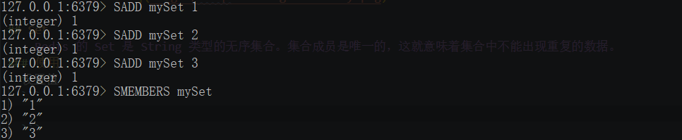
- 移除值
  ```
  SREM key value
  ```
  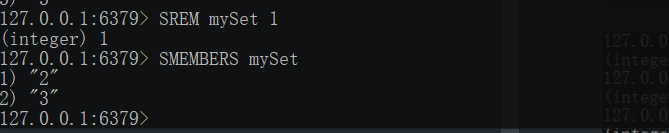
- 获取值
  ```
  SMEMBERS key
  ```
  

- 判断单个值是否在集合中
  ```
  SISMEMBER Key Value
  ```
  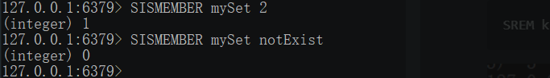

## Hash
    Redis hash 是一个string类型的field和value的映射表，hash特别适合用于存储对象。

> Redis 中每个 hash 可以存储 232 - 1 键值对（40多亿）。

### 使用
- 创建
  ```
  HMST key Hash
  ```
  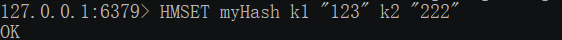

- 获取
  ```
  HGETALL key
  ```
  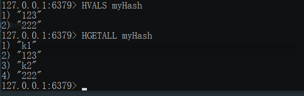

- 修改
  ```
  HSET KEY VALUE
  ```
  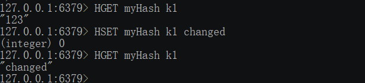

- 删除
  ```
  HDEL key field
  ```
  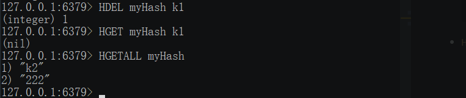
- `Hsetnx`: 哈希表中不存在的的字段赋值 。