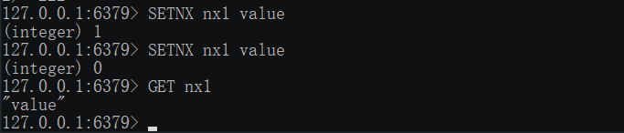

# 基于`Redis`的分布式锁实现
## 为什么需要锁
    在分布式集群中确保高并发下，同一时间只能被同一个线程执行.
常见的案例:
1. 缓存失效，多个进程同一时间对该缓存进行写的操作[缓存击穿]
2. 秒杀等场景[消息队列更适合]

## Redis `SETNX`

    SETNX Key Value


<!--more-->
注: 其实除了`String` `Hash` 也有 `	HSETNX key field value `

## 使用`Redis.SETNX` 构建分布式锁
### 场景
    线程在设置值时先使用`SETNX`确定是够有其他的线程在设置，如果没有则去设置。有则等待。

### 死锁问题：
    由某一线程设置的时候 `Crash`了。锁则成了死锁
>解决: 在设置的 **同时** 指定过期时间

### 实现

```js
const Redis = require('ioredis')
const redis = new Redis()
const util = require('util')

async function sleep(ms){
  return new Promise(resolve => setTimeout(resolve, ms))
}

async function locked(keyName, expireTime = 1000 * 5) {
  if(!util.isFunction(this.getData)) {
    return Promise.reject('arguments error, getData is not function . e.g: locked.call({getData:()=>{}, keyName, expireTime})')
  }
  // if(!keyName){
      // error rejected
  // }
  const nxKey = `${keyName}_nx`
  const tryLock = await redis.setnx(nxKey, (Date.now() + expireTime)) 
  if(tryLock) {
    await redis.pexpire(nxKey, expireTime) // 有个问题是没有运行到这一步的时候程序crash了... 然后就出现了死锁, 需要增加参数判断是第几次去重试
    const data = await this.getData() // 使用传参的方式可能会更好一点 但是有Error rejected 也可以接受看具体吧
    await redis.set(keyName, data)
    // 这里需要释放锁 
    // redis.del(nxKey) 为了测试。 注释掉了
    return data
  }
  else {
    await sleep(expireTime) 
    // 这里其实是锁的实现，具体业务应该是 到 getCacheData(keyName) -> cache中为空 -> 设置锁拉取数据 -> 设置锁成功-> 拉取成功 -》 删除锁 返回数据
    // getCacheData(keyName) -> cache中为空 -> 设置锁拉取数据 -> 设置锁失败-> 等待一段时间(1S完全足够了) -> getCacheData(keyName) 而不是再去调用locked() 
    return locked.call(this, keyName, expireTime)
  }
}

async function lockedTest() {
  const fake = {
    getData: function () {
      return Promise.resolve('fake data')
    }
  }
  const data = await locked.call(fake, "noSql-redis-lock-test")
  console.log(data)
  // process.send(new Date())
}

async function main() {
  // 这样其实也算是一个简单的伪测试
  lockedTest()
  lockedTest()
}
main()
// process.on('message',()=>{
//   lockedTest()
// })
```
### 测试
- test.js
``` js
const fork = require('child_process').fork
const numCPUs = require('os').cpus().length
const assert = require('assert')
function lockTest() {
    const workers = []
    for( let i = 0;i < numCPUs; i++){
        const forkProcess = fork(`${__dirname}/lock.js`)
        forkProcess.send('start exec')
        forkProcess.on('message',(_=>{
            console.log(_) //这里可以加入统计 然后最后计算看5s中有没有2个或者2个以上的消息收到。
        }))
        workers.push(forkProcess)
    }
    
}
lockTest()
```
- lock.js
```js
const Redis = require('ioredis')
const redis = new Redis()
const util = require('util')

async function sleep(ms){
  return new Promise(resolve => setTimeout(resolve, ms))
}

async function locked(keyName, expireTime = 1000 * 5) {
  if(!util.isFunction(this.getData)) {
    return Promise.reject('arguments error, getData is not function . e.g: locked.call({getData:()=>{}, keyName, expireTime})')
  }
  // if(!keyName){
      // error rejected
  // }
  const nxKey = `${keyName}_nx`
  const tryLock = await redis.setnx(nxKey, (Date.now() + expireTime)) 
  if(tryLock) {
    await redis.pexpire(nxKey, expireTime) // 有个问题是没有运行到这一步的时候程序crash了... 然后就出现了死锁, 需要增加参数判断是第几次去重试
    const data = await this.getData() // 使用传参的方式可能会更好一点 但是有Error rejected 也可以接受看具体吧
    await redis.set(keyName, data)
    // 这里需要释放锁 
    // redis.del(nxKey) 为了测试。 注释掉了
    return data
  }
  else {
    await sleep(expireTime) 
    // 这里其实是锁的实现，具体业务应该是 到 getCacheData(keyName) -> cache中为空 -> 设置锁拉取数据 -> 设置锁成功-> 拉取成功 -》 删除锁 返回数据
    // getCacheData(keyName) -> cache中为空 -> 设置锁拉取数据 -> 设置锁失败-> 等待一段时间(1S完全足够了) -> getCacheData(keyName) 而不是再去调用locked() 
    return locked.call(this, keyName, expireTime)
  }
}

async function lockedTest() {
  const fake = {
    getData: function () {
      return Promise.resolve('fake data')
    }
  }
  const data = await locked.call(fake, "noSql-redis-lock-test")
  console.log(data)
  process.send(new Date())
}

process.on('message',()=>{
  lockedTest()
})
```