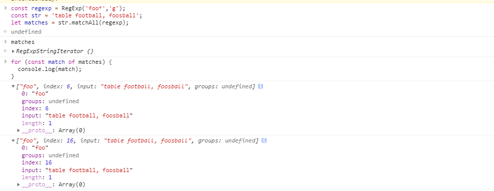
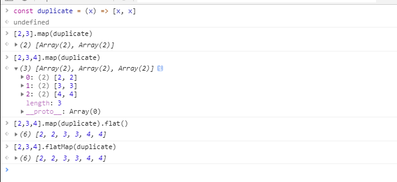
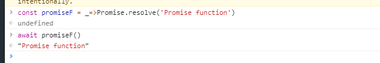

#  What’s new in JavaScript (Google I/O ’19)
[youtube: What’s new in JavaScript (Google I/O ’19)](https://www.youtube.com/watch?v=c0oy0vQKEZE)
## Number
### BigInt
```js
123 * 1234567890123456789
151851850485185200000

123n * 1234567890123456789n
151851850485185185047n
```

## String
### matchAll

## Class
- before
  ```js
    Class someClass{
        constructor() {
            this._count = 0
            // 或者使用Symbol('private') 定义私有变量
        }
    }
  ```
- after

  ```js
    Class someClass{
      #count = 0 //可以不用使用 constructor 以及可以使用 # 定义私有变量
    }
  ```

## Array
### Array.flat 扁平化数组
- 在没有`flat`函数之前我们怎么实现一个`flat`函数呢
  ```js
  flat = function(arr){
      while (arr.some(item => Array.isArray(item))) {
          arr = [].concat(...arr);
      }
      return arr
  }
  const array =  [1, [2, [3, 4]]]
  console.log(flat(array))
  [1, 2, 3, 4]
  ```
- 使用`flat`函数
  ``` js
  [1, [2, [3, 4]]].flat()
  ```
- REF:  [MDN Array flat](https://developer.mozilla.org/zh-CN/docs/Web/JavaScript/Reference/Global_Objects/Array/flat)
### Array.flatMap 
   比先执行`map` 在执行 `flat`更高效
  ```js
  const duplicate = (x) => [x, x]

  [2,3,4].map(duplicate)
  // -> [[2, 2], [3, 3], [4, 4]]
  [2,3,4].map(duplicate).flat()
  // [2, 2, 3, 3, 4, 4]
  [2,3,4].flatMap(duplicate)
  ```
  
  > `flatMap`会比先`map`再`flat`执行效率会快

## Object
### Object.fromEntries
    把键值对列表转换为一个对象。
> Object.fromEntries 是 Object.entries() 的反转函数

  ```js
  const object1 = { a: 1, b: 2, c: 3 };

  const object2 = Object.fromEntries(
    Object.entries(object1)
    .map(([ key, val ]) => [ key, val * 2 ])
  );

  console.log(object2);
  // { a: 2, b: 4, c: 6 }
  ```
REf: [Object fromEntries](https://developer.mozilla.org/zh-CN/docs/Web/JavaScript/Reference/Global_Objects/Object/fromEntries)

## Intl
     ECMAScript 国际化 API
### Intl.RelativeTimeFormat
    将日期改为本土化的语言显示
```js
var rtf1 = new Intl.RelativeTimeFormat('zh', { style: 'narrow' });

console.log(rtf1.format(3, 'quarter'));
// "3个季度后"

console.log(rtf1.format(-1, 'day'));
//"1天前"
```
REF: [MDN RelativeTimeFormat](https://developer.mozilla.org/zh-CN/docs/Web/JavaScript/Reference/Global_Objects/RelativeTimeFormat)

### Intel.ListFormat

```js
const vehicles = ['Motorcycle', 'Bus', 'Car'];

const formatter = new Intl.ListFormat('zh', { style: 'long', type: 'conjunction' });
console.log(formatter.format(vehicles));
```

## async

之前只能在`async function()` 或者使用 立即执行函数 中使用而不能直接使用。现在可以直接使用了
```js
const promiseF = _=>Promise.resolve('Promise function')
await promiseF()
```

> 现阶段只是提案

## Promise
### allSettled
### any

## weekRef
仍然在提案阶段。 主要是为了避免内存泄漏
### FinalizationGroup