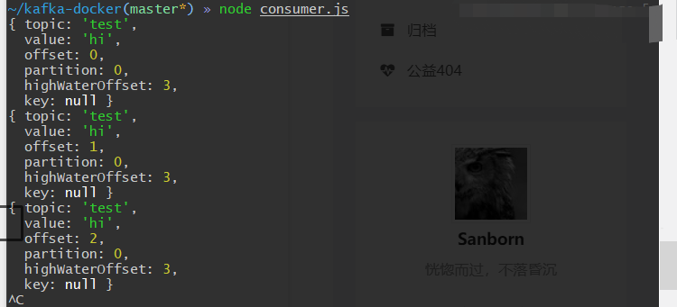
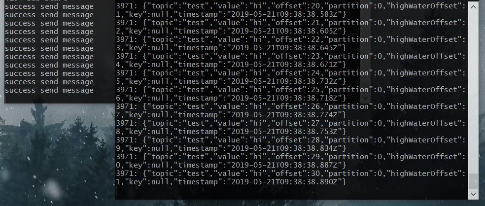

# 使用 kafka 作为消息队列
## 为什么需要消息队列
- 解耦： ISP
- 扩展性： 水平扩展
- 灵活性： 不同的语言
- 可恢复性：系统的一部分组件失效时，不会影响到整个系统
- 顺序保证： 秒杀类场景
- 异步处理： 延时任务
<!--more-->

## 为什么选择`kafka`
1. 提供Pub/Sub方式的海量消息处理。
2. 以高容错的方式存储海量数据流。
3. 保证数据流的顺序。
## 使用`docker-compose` 运行 `kafka`
1. clone kafka docker-compose 仓库
   ```bash
   git clone https://github.com/wurstmeister/kafka-docker

   ```
2. 修改`docker-compose`文件
   ```bash
   vi docker-compose.yml
    ports:
      - "9092:9092"
    ...
       KAFKA_ADVERTISED_HOST_NAME: ${yourIP}
   ```
3. `docker-compose up -d`

## 一个简单的`pub/sub`
- consumer.js
  ```js
  const kafka = require('kafka-node')
  const client = new kafka.KafkaClient({kafkaHost: '127.0.0.1:9092'})
  const Consumer = kafka.Consumer
  const consumer = new Consumer(client, 
    [{
    topic: 'test',
  } ],{
    autoCommit: false
  })
  consumer.on('error', (err)=>{
    console.log(err)
  })
  consumer.on('message', (message) => {
    console.log(message)
  })
  ```

- producer.js
  ``` js
  const kafka = require('kafka-node')
  const client = new kafka.KafkaClient({kafkaHost: '127.0.0.1:9092'})
  const Producer = kafka.Producer
  const producer = new Producer(client);

  producer.on('ready', () => {
    producer.send([{
        topic: 'test',
        messages: 'hi',
        partition: 0
      }], (err, data)=>{
        if(err) throw err
        console.log(`success send message`)
      })
  })

  producer.on('error', (err) => {
    throw err
  })
  ```

- 

## `At Most Once`
- ConsumerGroup
  + fromOffset 
    - earliest  
      当各分区下有已提交的offset时，从提交的offset开始消费；无提交的offset时，从头开始消费 
    - latest  
      当各分区下有已提交的offset时，从提交的offset开始消费；无提交的offset时，消费新产生的该分区下的数据 
    - none  
      topic各分区都存在已提交的offset时，从offset后开始消费；只要有一个分区不存在已提交的offset，则抛出异常
- producer.js
```js
const kafka = require('kafka-node')
const client = new kafka.KafkaClient({kafkaHost: '127.0.0.1:9092'})
const Producer = kafka.Producer
const producer = new Producer(client);
function sendMessage() {
  producer.on('ready', () => {
    producer.send([{
        topic: 'test',
        messages: 'hi',
        partition: 0
      }], (err, data)=>{
        if(err) throw err
        console.log(`success send message`)
      })
  })

  producer.on('error', (err) => {
    throw err
  })
}
module.exports = sendMessage
```

- Consumer.js
```js
const kafka = require('kafka-node')
const ConsumerGroup  = kafka.ConsumerGroup
const consumerGroupOptions =  {
  kafkaHost: '127.0.0.1:9092',
  groupId: 'ExampleTestGroup',
  protocol: ['roundrobin'],
}
function consumerListening(){
  const consumer = new ConsumerGroup (consumerGroupOptions, 'test')
  consumer.on('error', (err)=>{
    console.log(err)
  })
  consumer.on('message', (message) => {
    console.log(message)
    try {
    // test throw err
      // your handler
    } catch (error) {
      consumer.close()
    }
  })
}
module.exports = consumerListening

```

- 测试
  
### REF:
[when i deployed 2 nodejs servers to consume the same topic, one message is processed by both servers, but these 2 consumers' groupId are the same](https://github.com/SOHU-Co/kafka-node/issues/651)  
[Multiple consumer instances with the same group id](https://github.com/SOHU-Co/kafka-node/issues/368)