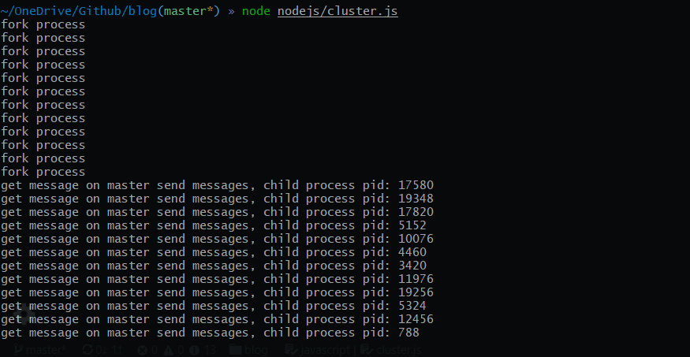
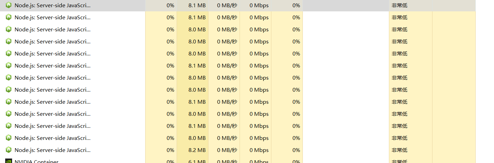

# Nodejs cluster 详解
    Node.js is designed for building distributed applications with many nodes. This is why it’s named Node
最开始使用`Node.js`也是抱着这个意味来的，但是并不代表我们不能在`Node.js`中构建多线程的应用
## fork
    在多任务操作系统中，行程（运行的程序）需要一种方法来创建新进程，例如运行其他程序。Fork及其变种在类Unix系统中通常是这样做的唯一方式。如果进程需要启动另一个程序的可执行文件，它需要先Fork来创建一个自身的副本。然后由该副本即“子进程”调用exec系统调用，用其他程序覆盖自身：停止执行自己之前的程序并执行其他程序。

    Fork操作会为子进程创建一个单独的定址空間。子进程拥有父进程所有内存段的精确副本。在现代的UNIX变种中，这遵循出自SunOS-4.0的虚拟内存模型，根据寫入時複製语义，物理内存不需要被实际复制。取而代之的是，两个进程的虚拟内存页面可能指向物理内存中的同一个页，直到它们写入该页时，写入才会发生。在用fork配合exec来执行新程序的情况下，此优化很重要。通常来说，子进程在停止程序运行前会执行一小组有利于其他程序的操作，它可能用到少量的其父进程的数据结构。

    当一个进程调用fork时，它被认为是父进程，新创建的进程是它的孩子（子进程）。在fork之后，两个进程还运行着相同的程序，都像是调用了该系统调用一般恢复执行。然后它们可以检查调用的返回值确定其状态：是父进程还是子进程，以及据此行事。

    fork系统调用在第一个版本的Unix就已存在，它借用于更早的GENIE 分時系統。Fork是标准化的POSIX的一部分。

<!--more-->

## child_process
- fork: 衍生一个新的 Node.js 进程，并通过建立 IPC 通信通道来调用指定的模块，该通道允许在父进程与子进程之间发送消息。
- subprocess.send(): 当父进程和子进程之间建立了一个 IPC 通道时（例如，使用 child_process.fork()）， subprocess.send() 方法可用于发送消息到子进程。 当子进程是一个 Node.js 实例时，消息可以通过 'message' 事件接收。

### 使用`child_process.fork` 实现主进程和子进程之间通信
- master.js
```
const child_process = require('child_process')
const numCPUs = require('os').cpus().length
const worker = []

for(let i = 0; i < numCPUs; i++) {
    console.log('fork process')
    const forkProcess = child_process.fork(`${__dirname}/child.js`)
    forkProcess.send('send messages')
    worker.push(forkProcess)
}

```

- child.js
```
process.on('message', (_)=>{
    console.log(`get message on master ${_}, child process pid: ${process.pid}`)
})
```
- 执行
  
- 查看运行情况


### 使用`child_process.fork` 实现负载均衡的`web`服务器


# REF
[Getting to know Node’s child_process module](https://medium.com/the-guild/getting-to-know-nodes-child-process-module-8ed63038f3fa)