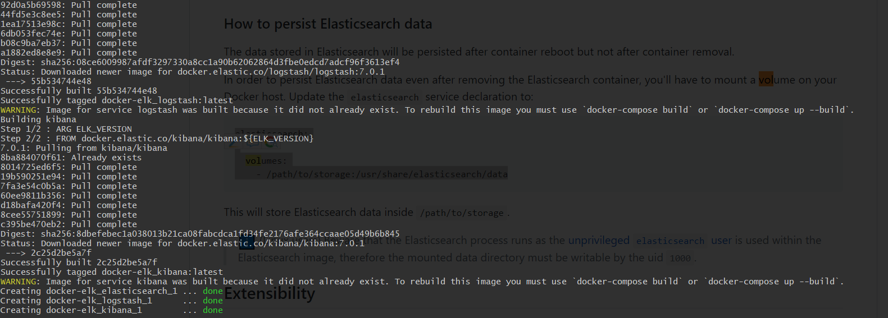
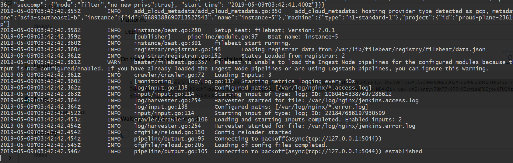
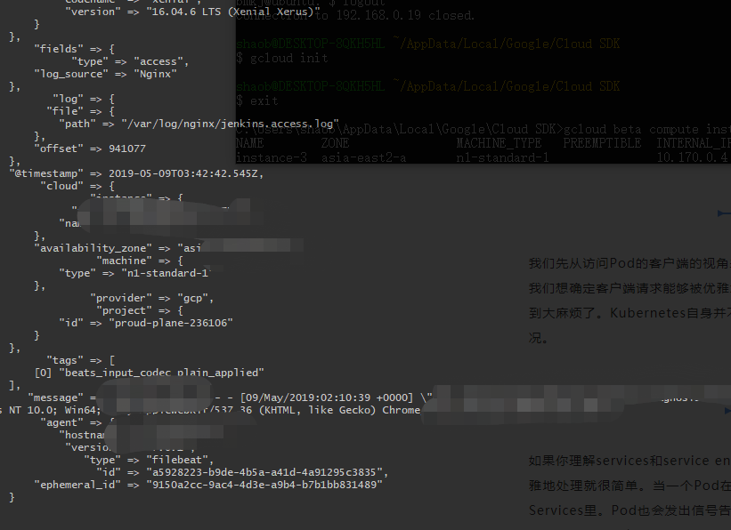
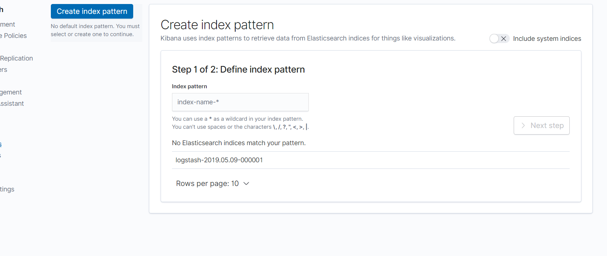
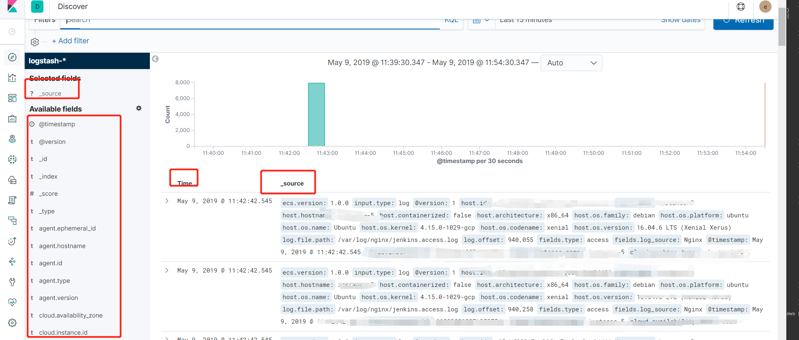
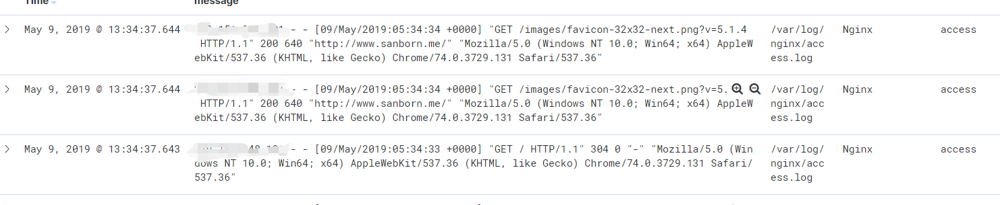

# ELK
## 什么是ELK
`ELK`是三个开源项目的首字母缩写：`Elasticsearch`，`Logstash`和`Kibana`。
- `Elasticsearch`是一个搜索和分析引擎。
- `Logstash`是一个服务器端数据处理管道，它同时从多个源中提取数据，对其进行转换，然后将其发送到像`Elasticsearch`这样的“存储”。
- `Kibana`允许用户使用`Elasticsearch`中的图表和图形来可视化数据。
<!--more--> 
## 使用`docker-compose`安装`ELK`
1. clone
   ```
   git clone https://github.com/deviantony/docker-elk
   ```

2. 将 `elasticsearch` 的数据映射到磁盘上
   ```
   vi docker-compose.yml
  
   elasticsearch:

    volumes:
      - /path/to/storage:/usr/share/elasticsearch/data
    environment:
      ES_JAVA_OPTS: "-Xmx512m -Xms512m"

   ```
   > 这里需要注意2项 
      1. chown -R 1000:1000 /path/to/storage 
      2. 主机上的内存是否足够

3. 启动ELK  `docker-compose up -d` 
  

4. 查看`kibana`
  
  默认密码为`changeme` 用户为`elastic`
  

5. 安装`filebeat`
      ```
      # curl -O https://artifacts.elastic.co/downloads/beats/filebeat/filebeat-7.0.1-amd64.deb     
        % Total    % Received % Xferd  Average Speed   Time    Time     Time  Current
                                       Dload  Upload   Total   Spent    Left  Speed
      100 13.0M  100 13.0M    0     0  30.2M      0 --:--:-- --:--:-- --:--:-- 30.2M
      # dpkg -i filebeat-7.0.1-amd64.deb                                                          
      Selecting previously unselected package filebeat.
      (Reading database ... 112108 files and directories currently installed.)
      Preparing to unpack filebeat-7.0.1-amd64.deb ...
      Unpacking filebeat (7.0.1) ...
      Setting up filebeat (7.0.1) ...
      Processing triggers for systemd (229-4ubuntu21.21) ...
      Processing triggers for ureadahead (0.100.0-19) ...
      ```

6. 修改`filebeat` 配置
     ```
      - type: log
      enabled: true
      paths:
        - /var/log/nginx/*.access.log
      fields:
        log_source: Nginx
        type: access
      - type: log
        enabled: true
        paths:
          - /var/log/nginx/*.error.log
        fields:
          log_source: Nginx
          type: error
      output.logstash:
        # The Logstash hosts
        hosts: ["127.0.0.1:5044"]
     ```

6. 添加`logstash` `pipeline`  
   在`docker-compose-elk/logstash/pipeline`中新增一个配置文件
   ```
   input {
      beats {
       port => 5044
     }
   }
   output {
     stdout{codec => rubydebug}
     elasticsearch {
       hosts => "elasticsearch:9200"
       user => elastic
       password => changeme
     }
   }
   ```

7. 重新启动 `logstash`

8. 使用命令行运行 `filebeat` 推送日志到 `logstash`中
   ```
   filebeat run -e -c path/to/filebeat.yml
   ```
     

9. 查看 `logstash` 的日志
   

10. 在`kibana`中创建`Index`
  

11. 在`kibana.discover`中查看
    
    
    > 这里看出 message的字段是一整段内容，可能实际情况中我们还要对这些内容放在不同的字段里保存。那么我们可以使用`logstash` 去解析[gork json]

使用`docke-compose` 能够快速帮助我们搭建一个elk的平台，在初期这是可以的。可能我们需要的东西不多，只需要日志收集以及分析，日志量很小的情况下完全没问题。但是随着时间的增加，日志量的增加，需求的增多。那么我们可能就需要深入学习具体的内容了。