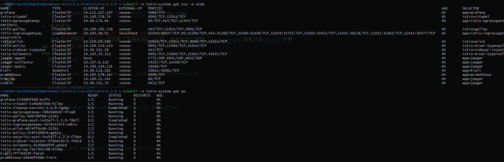
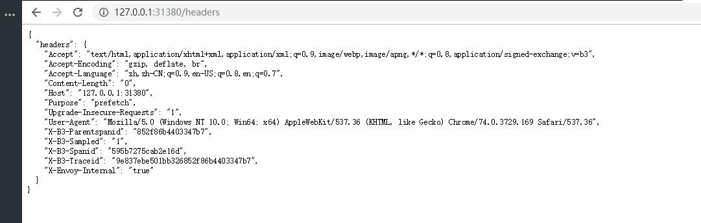
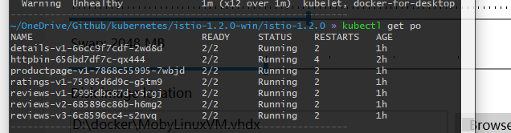
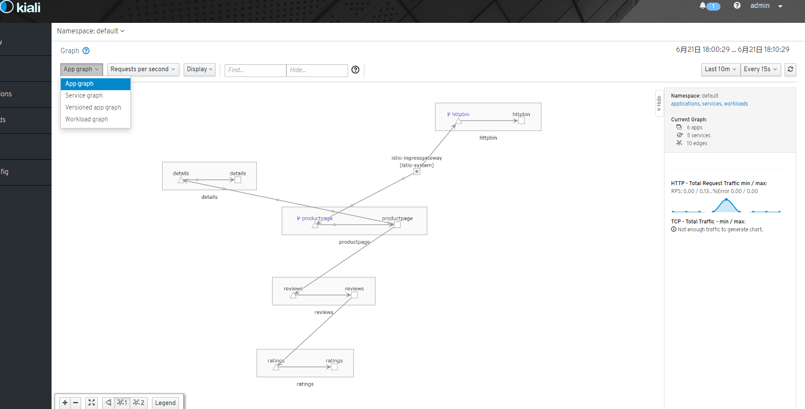

# Istio
- 连接:  
  * 对网格内部的服务之间的调用所产生的流量进行智能管理.
  * 负载均衡
  * 动态路由
  * 灰度发布
  * 故障注入
- 安全:  
  为网格内服务之间的调用提供认证、加密和鉴权支持,在不侵入代码的情况下，提高固有服务的安全性.(共享集群)
- 策略:  
  在控制面定制策略.
  * 限流
  * ACL
- 观察:  
  * 对服务之间的调用进行跟踪和测量，获取服务的状态信息.
  * 调用链
  * 访问日志
  * 监控
<!--more-->
## 组件
### Pilot
- 获取服务信息，完成服务发现.
- 读取`istio`配置,转换以后分发到数据面. 
### Mixer
- 监听`Kubernetes`获取配置的变化.
- 预检: 服务每次在调用前都向`Mixer`发起预检请求,查看调用是否被允许执行.
- 汇报: 在服务每次调用之后,都发出报告信息,向`Mixer`汇报调用过程中产生的监控和跟踪数据.
### CA
证书管理
### Sidecar
负责控制层面对网格控制的实际执行.

## 安装
1. Istio releases page下载对应的操作平台: [istio releases](https://github.com/istio/istio/releases)
   > 目前最新版本为1.2 在1.2 win版本中包含了`kiali`
2. 解压进入到目录 
3. 安装CRD
     ```bash
     for i in install/kubernetes/helm/istio-init/files/crd*yaml; do kubectl apply -f $i; done
     ```
     如果没有这个文件的话，去找对应的`crd.yaml`文件

4. 安装 Istio
     ```bash
     kubectl apply -f install/kubernetes/istio-demo.yaml
     ```
     
5. 检查服务
   

## 修改`service`使外部能够访问
- 修改`istio-ingressgateway`
  ```yaml
  apiVersion: v1
  kind: Service
  metadata:
    name: istio-ingressgateway
    namespace: istio-system
    annotations:
    labels:
      chart: gateways
      heritage: Tiller
      release: istio
      app: istio-ingressgateway
      istio: ingressgateway
  spec:
    type: NodePort
    ```

- 修改`kiali`
  ```yaml
  apiVersion: v1
  kind: Service
  metadata:
    name: kiali
    namespace: istio-system
    labels:
      app: kiali
      chart: kiali
      heritage: Tiller
      release: istio
  spec:
    type: NodePort
    ports:
    - name: http-kiali
      protocol: TCP
      port: 20001
      nodePort: 30081
    selector:
      app: kiali
  ```

- 修改`prometheus`
  ```yaml
  apiVersion: v1
  kind: Service
  metadata:
    name: prometheus
    namespace: istio-system
    annotations:
      prometheus.io/scrape: 'true'
    labels:
      app: prometheus
      chart: prometheus
      heritage: Tiller
      release: istio
  spec:
    selector:
      app: prometheus
    type: NodePort
    ports:
    - name: http-prometheus
      nodePort: 30001
      protocol: TCP
      port: 9090
  ```

- 修改`grafana`
  ```yaml
  apiVersion: v1
  kind: Service
  metadata:
    name: grafana
    namespace: istio-system
    annotations:
    labels:
      app: grafana
      chart: grafana
      heritage: Tiller
      release: istio
  spec:
    type: NodePort
    ports:
      - port: 3000
        targetPort: 3000
        protocol: TCP
        nodePort: 30002
        name: http
    selector:
      app: grafana
  ```


## 使用自动注入 
- 启动自动注入
  ``` bash
  kubectl label namespace default istio-injection=enabled 
  ```
- disable injection

  ```bash
  kubectl label namespace default istio-injection-
  ```


- list ns
  ```bash
  kubectl get namespace -L istio-injection
  ```

## httpbin
1. install 
   ```bash
   kubectl apply -f samples/httpbin/httpbin.yaml
   ```
2. 查看是否安装成功
   
3. 创建 `Gateway` 以及 `VirtualService`
   ```yaml
   #Gateway
   apiVersion: networking.istio.io/v1alpha3
   kind: Gateway
   metadata:
     name: httpbin-gateway
   spec:
     selector:
       istio: ingressgateway # use Istio default gateway implementation
     servers:
     - port:
         number: 80
         name: http
         protocol: HTTP
       hosts:
       - "*"
   ---
   apiVersion: networking.istio.io/v1alpha3
   kind: VirtualService
   metadata:
     name: httpbin
   spec:
     hosts:
     - "*"
     gateways:
     - httpbin-gateway
     http:
     - match:
       - uri:
           prefix: /headers
       route:
       - destination:
           port:
             number: 8000
           host: httpbin


   ```
4. 配置流量规则
   ```bash
   kubectl apply -f httpbin.gateway.yaml
   ```
5. 查看能否访问 http://127.0.0.1:31380/headers
   

## BookInfo应用
1. 创建`bookinfo` `POD`:
   ``` bash
   kubectl apply -f samples/bookinfo/platform/kube/bookinfo.yaml
   ```

     
     >这里需要注意的是资源 如果资源不够很可能起不起来服务

2. 创建路由规则
  ```
  kubectl apply -f samples/bookinfo/networking/bookinfo-gateway.yaml     
  ```    
  
  

## 总结
到此我们就已经搭建了一个`istio demo`,以及使用了自动注入的功能(`namespace=default`)。并且 有了一个简单的http页面`httpbin`，以及一个 `book-info`应用。
