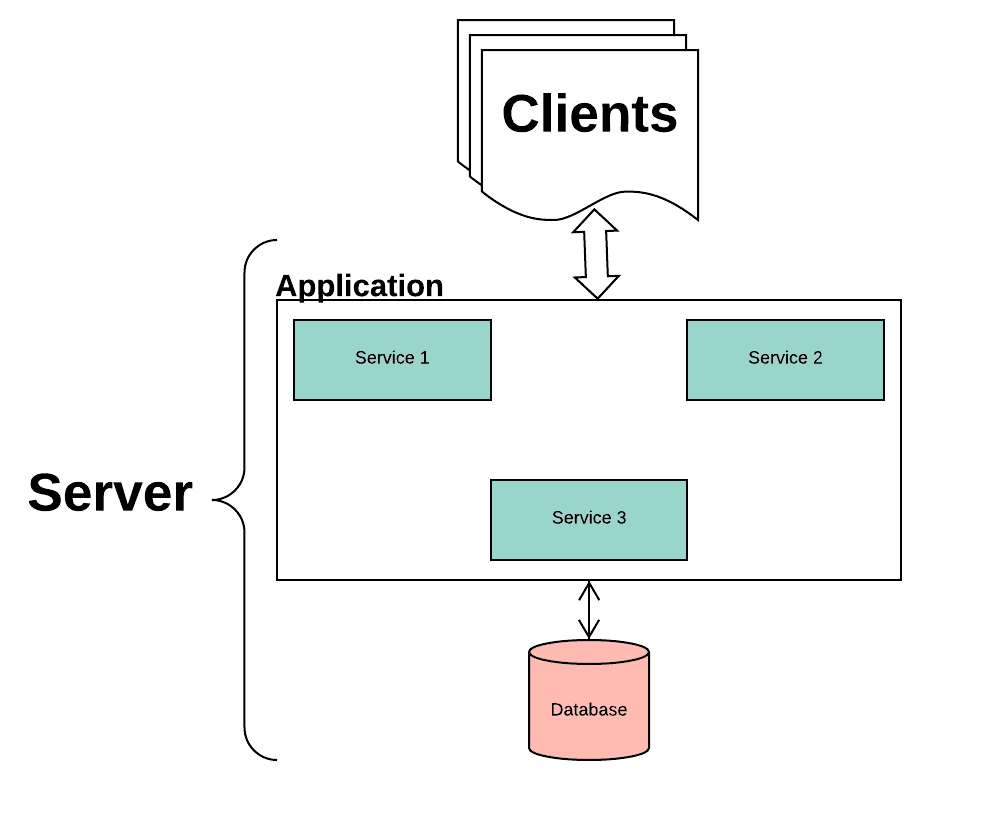

# A Tour of the Kubernetes Part One
## 在说说 Kubernetes 之前我们先说说
### 微服务
    "微服务 (Microservices) 是一种软件架构风格，它是以专注于单一职责功能的小型功能模块 (Small Building Blocks) 为基础，利用模块化的方式组合出复杂的大型应用系统，各功能自建使用和语言无关 (Language-Independent/Language agnostic) 的 API 集相互通訊。" --- wiki  
---
    "微服务架构是一种架构模式，它提倡将单一应用程序划分成一组小的服务，服务之间相互协调、互相配合，为用户提供最终价值。每个服务运行在其独立的进程中，服务和服务之间采用轻量级的通信机制相互沟通（通常是基于HTTP的Restful API).每个服务都围绕着具体的业务进行构建，并且能够被独立的部署到生产环境、类生产环境等。另外，应尽量避免统一的、集中的服务管理机制，对具体的一个服务而言，应根据业务上下文，选择合适的语言、工具对其进行构"---- Martin Fowler的博客
REF: [wiki: 微服务](https://zh.wikipedia.org/wiki/%E5%BE%AE%E6%9C%8D%E5%8B%99)
<!--more-->
### 单体应用
  
  

#### 优点
- 易于开发
- 易于部署
- 易于扩展？ (如果开发没有考虑到水平扩展的场景，很可能出现问题)

#### 缺点
- 单体应用巨大的代码库可能会让人望而生畏。对新人不是很友好?(代码质量管理)
- 过载的Web容器——应用越大，Web容器启动时间越长。
- 部署困难， 新增一个功能必须重新部署整个方案。
- 应用扩展困难——单体架构只能进行一维伸缩。[无法伸缩某个组件]
- 难于进行规模化开发。
- 需要长期关注同一套技术栈。

这也是单体应用之后，使用很老旧的技术。[虽然大多都是新瓶装旧酒，但是不可否认的都是为了解决某种问题]😂😂😂

### 微服务

  

#### 优点
* 每个服务相对较小： 独立开发、独立部署
* 松耦合
* 能使用不同的语言开发
* 易于集成
* 故障隔离

### 缺点
* 调试困难，
* 部署困难？ 有状态应用
* 管理困难
* 过多的操作
* 服务间的调用耗费时间过长

### docker
+ 轻量
  - 在一台机器上运行的多个 Docker 容器可以共享这台机器的操作系统内核;  
  - 它们能够迅速启动，只需占用很少的计算和内存资源;  
  - 镜像是通过文件系统层进行构造的，并共享一些公共文件。这样就能尽量降低磁盘用量，并能更快地下载镜像;
  - 
- 标准  
  Docker 容器基于开放式标准，能够在所有主流 Linux 版本、Microsoft Windows 以及包括 VM、裸机服务器和云在内的任何基础设施上运行.    
  一处构建，到处运行。
- 安全  
  Docker 赋予应用的 **隔离性** 不仅限于彼此隔离，还独立于底层的基础设施。Docker 默认提供最强的隔离，因此应用出现问题，也只是单个容器的问题，而不会波及到整台机器。

### Docker 解决了什么问题
不管我们开发了多少个应用程序，或者是以什么样的方式拆分。开发和运维总是要解决的最大的问题就是: `"程序运行环境之间的差异"`。  
也就是我的电脑上能跑，但是到了生产环境就不行了。  
1. 系统层面的差异： 这种差异不仅是 开发环境和生产环境之间的不同，每台服务器之间的差异都很有可能不一样。而且随着时间的推移生产环境也会发生相应的变化。 
2. 人员理解的差异： 开发环境可能是由开发人员去维护的，生产环是由运维人员进行维护的。这两组人员对于系统管理环境的理解程度是不同的，这个理解导致两个环境会有较大的差异。  

为了减少仅会在生产环境中出现的问题，最理想的做法是： 让开发阶段和生产阶段运行在完全相同的环境下，它们有**完全相同的** `操作系统`、`库`、`系统配置`、`网络环境`和其他所有条件，这个环境不会随着时间的推移而改变，而且如果在同一台服务器上部署新的应用时，不会影响到现有应用。

## Dev OPS 和 No OPS
### Dev OPS
      让同 个团队参与应用的开发、部署 、运维的整个生命周期更好,这意味着开发者 QA 和运维团队彼此之间的合作,需要贯穿整个流程.这种实践被称为 Dev Ops。
REF: [DevOps](https://zh.wikipedia.org/wiki/DevOps)
### No OPS
      理想情况是， 开发者是部署程序本身， 不需要知道硬件基础设施的任何情况，也不需要和运维团队交涉， 这被叫作NoOps。
Kubernetes 能让我们实现所有这些想法。 通过对实际硬件做抽象， 然后将自身暴露成一个平台， 用于部署和运行应用程序。 它允许开发者自己配置和部署应用程序， 而不需要系统管理员的任何帮助， 让系统管理员聚焦于保持底层基础设施运转正常的同时， 不需要关注实际运行在平台上的应用程序。

#### Docker 和微服务之间的关系
  微服务把应用拆分位多个单体应用，对于部署来说是一个很大的挑战，所以Docker实际上是解决部署上的一系列问题， 关键就是 **标准** **隔离**

## 简单介绍k8s
    Kubernetes 是用于自动部署，扩展和管理容器化应用程序的开源系统。
    Kubernetes 项目最主要的设计思想是，从更宏观的角度，以统一的方式来定义任务之间的各种关系，并且为将来支持更多种类的关系留有余地。

## 什么是 Kubernetes
Kubernetes 是 Google 开源的容器集群管理系统，是 Google 多年大规模容器管理技术 Borg 的开源版本，也是 CNCF 最重要的项目之一，主要功能包括：
- 基于容器的应用部署、维护和滚动升级;
- 负载均衡和服务发现;
- 跨机器和跨地区的集群调度;
- 自动伸缩
- 无状态和有状态服务
- 广泛的volume支持
- 插件机制保证

## Kubernetes 解决了什么问题
      Kubernetes是一个开源的Docker容器编排系统，它可以调度计算集群的节点，动态管理上面的作业，保证它们按用户期望的状态运行。  
1. 使开发者不用担心基础设施
2. 帮助运维团队提高资源利用率
> 编排： 按照用户定义规则，完全自动化的处理容器之间的各种关系。

> 调度： 把一个容器按照某种规则，放置在最佳节点上运行起来。 

## 我们能用`Kubernetes` 做什么?
- 快速精准地部署应用程序并且非常简便
- 无缝 **伸缩**
- 自动部署和**回滚**
- **资源限制**
- **健康检查**，**自动修复**
- **服务发现** 和 **负载均衡**

## 简单的介绍 Kubernetes 的一些概念
### POD
    Pod，是 Kubernetes 项目中最小的 API 对象，一个 Pod 中包含多个 container。Pod 里面的所有容器共享的是同一个 Network Namespace，并且可以声明共享同一个 Volume
  ---
  ``` yaml
  apiVersion: v1
  kind: Pod
  metadata:
    name: pod1
    labels:
      tier: frontend
  spec:
    containers:
    - name: hello1
      image: gcr.io/google-samples/hello-app:2.0
  ```

### ReplicaSet
    ReplicaSet可确保指定数量的pod“replicas”在任何设定的时间运行
  ---
  ``` yaml
  apiVersion: apps/v1
  kind: ReplicaSet
  metadata:
    name: frontend
    labels:
      app: guestbook
      tier: frontend
  spec:
    # modify replicas according to your case
    replicas: 3
    # .spec.template.metadata.labels must match spec.selector, or it will be rejected by the API.
    selector:
      matchLabels:
        tier: frontend
    template:
      metadata:
        labels:
          tier: frontend
      spec:
        containers:
        - name: php-redis
          image: gcr.io/google_samples/gb-frontend:v3
  ```

#### Job/CronJob
    Job 负责批量处理短暂的一次性任务 (short lived one-off tasks)，即仅执行一次的任务，它保证批处理任务的一个或多个 Pod 成功结束。
  ---
  ```yaml
  apiVersion: batch/v1
  kind: Job
  metadata:
    name: pi
  spec:
    template:
      metadata:
        name: pi
      spec:
        containers:
        - name: pi
          image: perl
          command: ["perl",  "-Mbignum=bpi", "-wle", "print bpi(2000)"]
        restartPolicy: Never
  ```

#### DaemonSet
    DaemonSet 可以保证集群中所有的或者部分的节点都能够运行同一份 Pod 副本；
    每当有新的节点被加入到集群时，Pod 就会在目标的节点上启动；
    如果节点被从集群中剔除，节点上的 Pod 也会被垃圾收集器清除；
    DaemonSet 的作用就像是计算机中的守护进程，它能够运行集群存储、日志收集和监控等『守护进程』，这些服务一般是集群中必备的基础服务。
---
  ```yaml
  apiVersion: apps/v1
  kind: DaemonSet
  metadata:
    name: fluentd-elasticsearch
    namespace: kube-system
    labels:
      k8s-app: fluentd-logging
  spec:
    selector:
      matchLabels:
        name: fluentd-elasticsearch
    template:
      metadata:
        labels:
          name: fluentd-elasticsearch
      spec:
        containers:
        - name: fluentd-elasticsearch
          image: k8s.gcr.io/fluentd-elasticsearch:1.20
          resources:
            limits:
              memory: 200Mi
            requests:
              cpu: 100m
              memory: 200Mi
          volumeMounts:
          - name: varlog
            mountPath: /var/log
          - name: varlibdockercontainers
            mountPath: /var/lib/docker/containers
            readOnly: true
        terminationGracePeriodSeconds: 60
        volumes:
        - name: varlog
          hostPath:
            path: /var/log
        - name: varlibdockercontainers
          hostPath:
            path: /var/lib/docker/containers
  ```

### Deployment
    Kubernetes提供了一种更加简单的更新RC和Pod的机制，叫做Deployment。通过在Deployment中描述你所期望的集群状态，Deployment Controller会将现在的集群状态在一个可控的速度下逐步更新成你所期望的集群状态。Deployment主要职责同样是为了保证pod的数量和健康，可以看做新一代的Replication Controller。但是，它又具备了Replication Controller之外的新特性：

  1. 创建`Deployment` 生成对应的`RC`并完成`Pod`的创建过程
  2. 扩展`Deployment` 应对高负载

  3. 事件和状态查看：可以查看`Deployment`的升级详细进度和状态。

  4. 回滚：当升级pod镜像或者相关参数的时候发现问题，可以使用回滚操作回滚到上一个稳定的版本或者指定的版本。

  5. 版本记录: 每一次对1的操作，都能保存下来，给予后续可能的回滚使用。

  6. 暂停和启动：对于每一次升级，都能够随时暂停和启动。

  7. 多种升级方案：Recreate----删除所有已存在的pod,重新创建新的; RollingUpdate----滚动升级，逐步替换的策略，同时滚动升级时，支持更多的附加参数，例如设置最大不可用pod数量，最小升级间隔时间等等。

  ---

  ```yaml
  apiVersion: apps/v1
  kind: Deployment
  metadata:
    name: nginx-deployment
    labels:
      app: nginx
  spec:
    replicas: 3
    selector:
      matchLabels:
        app: nginx
    template:
      metadata:
        labels:
          app: nginx
      spec:
        containers:
        - name: nginx
          image: nginx:1.7.9
          ports:
          - containerPort: 80
  ```

### StatefulSet
StatefulSet是为了解决有状态服务的问题（对应Deployments和ReplicaSets是为无状态服务而设计），其应用场景包括：

* 稳定，唯一的网络标志。
* 稳定，持久化存储。
* 有序，优雅地部署和 scale。
* 有序，优雅地删除和终止。
* 有序，自动的滚动升级。

### Service
     逻辑上的一组 Pod，一种可以访问它们的策略 —— 通常称为微服务。 这一组 Pod 能够被 Service 访问到，通常是通过 Label Selector 实现的。
---
 ```yaml
  apiVersion: v1
  kind: Service
  metadata:
    name: nginx
  spec:
    selector:
      app-name: my-nginx
    type: ClusterIP
    ports:
      - name: http
        port: 80
        protocol: TCP
        targetPort: 80
  ```

#### Service的功能
1. 服务发现： 通过 `${service name}`.`${namespace 名称}`.`svc.cluster.local` 访问对应的服务
2. 负载均衡

#### 暴露服务的几种方式[服务提供对外访问]
##### NodePort
    通过每个 Node 上的 IP 和静态端口（NodePort）暴露服务。NodePort 服务会路由到 ClusterIP 服务，这个 ClusterIP 服务会自动创建。通过请求 <NodeIP>:<NodePort>，可以从集群的外部访问一个 NodePort 服务。

##### LoadBalancer
    使用云提供商的负载局衡器，可以向外部暴露服务。外部的负载均衡器可以路由到 NodePort 服务和 ClusterIP 服务。

##### Ingress
    Ingress 是一种 Kubernetes 资源，它封装了一系列规则和配置，可将外部 HTTP(S) 流量路由到内部服务。

### PV/PVC
      PersistentVolume（PV）是由管理员设置的存储，它是群集的一部分。就像节点是集群中的资源一样，PV 也是集群中的资源。 PV 是 Volume 之类的卷插件，但具有独立于使用 PV 的 Pod 的生命周期。此 API 对象包含存储实现的细节，即 NFS、iSCSI 或特定于云供应商的存储系统。

      PersistentVolumeClaim（PVC）是用户存储的请求。它与 Pod 相似。Pod 消耗节点资源，PVC 消耗 PV 资源。Pod 可以请求特定级别的资源（CPU 和内存）。声明可以请求特定的大小和访问模式（例如，可以以读/写一次或 只读多次模式挂载）。

### HPA
     Horizontal Pod Autoscaling可以根据CPU利用率自动伸缩一个Replication Controller、Deployment 或者Replica Set中的Pod数量（或者基于一些应用程序提供的度量指标，目前这一功能处于alpha版本）

1. deployment
   ``` bash
   kubectl autoscale deployment php-apache --cpu-percent=50 --min=1 --max=10
   ```
2. ReplicaSet

   ``` yaml
   apiVersion: autoscaling/v1
   kind: HorizontalPodAutoscaler
   metadata:
     name: frontend-scaler
   spec:
     scaleTargetRef:
       kind: ReplicaSet
       name: frontend
     minReplicas: 3
     maxReplicas: 10
     targetCPUUtilizationPercentage: 50
   ```

## 资源的限制
### limitRange
针对于`Pod|container`的资源限制

```yaml
apiVersion: v1
kind: LimitRange
metadata:
  name: cpu-limit-range
spec:
  limits:
  - default:
      cpu: 1
    defaultRequest:
      cpu: 0.5
    type: Container
```

> 现在如果在 `default` 命名空间创建一个容器，该容器没有声明自己的 CPU 请求和限制时，将会给它指定默认的 CPU 请求0.5和默认的 CPU 限制值1.

### resourceQuota
- 针对于命名空间的资源限制:  
   使用`ResourceQuota`需要在api-server启动的时候添加对应的插件

   ```bash
   vi /etc/kubernetes/manifests/kube-apiserver.yaml

   --enable-admission-plugins=NamespaceLifecycle,LimitRanger,ResourceQuota
   ```

- 一个`ResourceQuota`的例子:  

  ```yaml
  apiVersion: v1
  kind: ResourceQuota
  metadata:
    name: ${yourName}
    namespace: ${yourNameSpace}
  spec:
    hard:
      requests.cpu: 4
      requests.memory: 13Gi
      limits.cpu: 7
      limits.memory: 14Gi
  ```

### 调度 
- NodeName:  
  Pod.spec.nodeName用于强制约束将Pod调度到指定的Node节点上。
- NodeSelector:  
  是通过kubernetes的label-selector机制进行节点选择，由scheduler调度策略MatchNodeSelector进行label匹配，调度pod到目标节点.
- Taints:  
  taint 定义在node上，排斥pod
- 和 Tolerations :  
  toleration定义在pod中，容忍pod

## 资源
1. [awesome-kubernetes](https://github.com/ramitsurana/awesome-kubernetes)
2. [awesome-docker](https://github.com/veggiemonk/awesome-docker)
3. [微服务：从设计到部署](https://github.com/DocsHome/microservices)
4. [kubernetes 最佳实践](https://medium.com/@sachin.arote1/kubernetes-best-practices-9b1435a4cb53)

## REF:
1. [kubernetes](https://kubernetes.io/zh/)
2. [模式: 单体架构](https://microservices.io/patterns/cn/monolithic.html)
3. [模式: 微服务架构](https://microservices.io/patterns/cn/microservices.html)
4. [What are microservices?](https://microservices.io/)
5. [什么是微服务架构](https://www.zhihu.com/question/65502802)
6. [Docker 和微服务的崛起](https://www.infoq.cn/article/docker-and-the-rise-of-micorservice)
7. [DOCKER基础技术：LINUX NAMESPACE（上）](https://coolshell.cn/articles/17010.html)
8. [DOCKER基础技术：LINUX NAMESPACE（下）
](https://coolshell.cn/articles/17029.html)
7. [Kubernetes in Action](https://book.douban.com/subject/30418855/)
8. [Kubernetes handbook](https://jimmysong.io/kubernetes-handbook/concepts/concepts.html)
9. [面向 Kubernetes 编程：Kubernetes 是下一代操作系统](https://www.servicemesher.com/blog/the-data-center-os-kubernetes/)