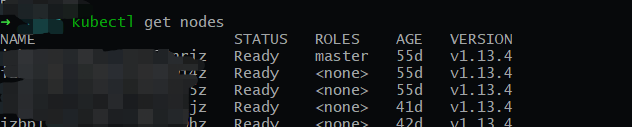
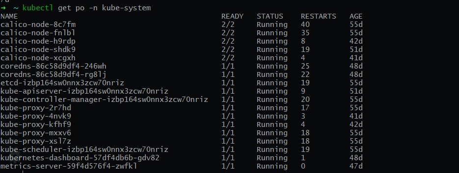

# Kubernetes 安装以及kubectl的使用
## Install
  安装的话可以使用`kubeadm`安装[不是**Production ready**]
### 使用 `kubeadm` 安装
- 安装 kubeadm

     ```
     apt-get update && apt-get install -y apt-transport-https curl
     ```
     ```
     curl -s https://packages.cloud.google.com/apt/doc/apt-key.gpg | apt-key add -
     ```
     > 在无法访问`google`的情况可以使用curl -x 来使用代理服务器访问
     ```
     cat <<EOF >/etc/apt/sources.list.d/kubernetes.list
     deb https://apt.kubernetes.io/ kubernetes-xenial main
     EOF
     apt-get update
     apt-get install -y kubelet kubeadm kubectl
     apt-mark hold kubelet kubeadm kubectl
     ```
<!--more--> 
- master 节点安装  
  需要注意的是： 使用有些网络插件 需要指定ip地址范围
  ```
  kubeadm init --pod-network-cidr=192.168.0.0/16

  kubectl apply -f https://docs.projectcalico.org/v3.3/getting-started/kubernetes/installation/hosted/rbac-kdd.yaml
  kubectl apply -f https://docs.projectcalico.org/v3.3/getting-started/kubernetes/installation/hosted/kubernetes-datastore/calico-networking/1.7/calico.
  ```
  安装完成以后会有以下的数据输出
    ```
    Your Kubernetes master has initialized successfully!

    To start using your cluster, you need to run the following as a regular user:

      mkdir -p $HOME/.kube
      sudo cp -i /etc/kubernetes/admin.conf $HOME/.kube/config
      sudo chown $(id -u):$(id -g) $HOME/.kube/config

    You should now deploy a pod network to the cluster.
    Run "kubectl apply -f [podnetwork].yaml" with one of the options listed at:
      https://kubernetes.io/docs/concepts/cluster-administration/addons/

    You can now join any number of machines by running the following on each node
    as root:

      192.168.0.x:6443 --token 1111.111111 --discovery-token-ca-cert-hash sha256:11111111111111111111111111111111111111111111111111
    ```
    在`Master`节点中执行
    ```
    mkdir -p $HOME/.kube
    sudo cp -i /etc/kubernetes/admin.conf $HOME/.kube/config
    sudo chown $(id -u):$(id -g) $HOME/.kube/config
    ```
- 子节点加入集群
  复制之前输出的 token
  ```
  kubeadm join ${youtMasterIP}:6443 --token ${yourToken} --discovery-token-ca-cert-hash sha256:${yourSha256}
  ```
- 在主节点中查看
  ```
  kubectl get nodes
  ```
  
- 验证 `Kubernetes` 是否安装成功
  
  > 为什么这么多重启的稍后再说
### 其他方式安装
- [在CentOS上安装kubernetes](https://jimmysong.io/kubernetes-handbook/practice/install-kubernetes-on-centos.html)
- [CentOS 使用二进制部署 Kubernetes 1.13集群](https://www.kubernetes.org.cn/4963.html)
- [kubespray](https://github.com/kubernetes-sigs/kubespray)
### Install 安装的一些`坑`[Ubuntu]
1. 需要注意的是主机`hostname`不能相同
2. 发现网络插件无限重启那么一般是 `/etc/resolv.conf`文件出现问题
   - `vi /etc/resolv.conf ` 添加上 `nameserver 8.8.8.8`
   - `vi /etc/hosts` 添加上 `127.0.0.1 ${yourHostName}`
3. `GFW`的问题
   - `Docker`以及`apt`使用代理
   - 下载二进制文件，把对应的镜像转到其他仓库中
## awesome kubernetes
https://github.com/ramitsurana/awesome-kubernetes
## REF
[Kubernetes 权威指南](https://book.douban.com/subject/26902153/)
[深入剖析 Kubernetes](https://time.geekbang.org/column/article/39724)