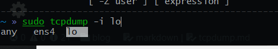
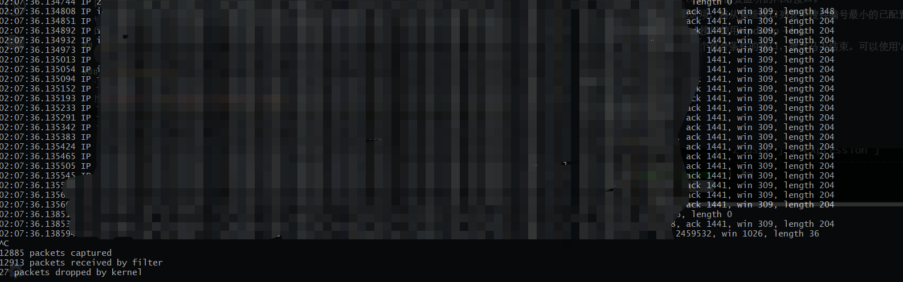
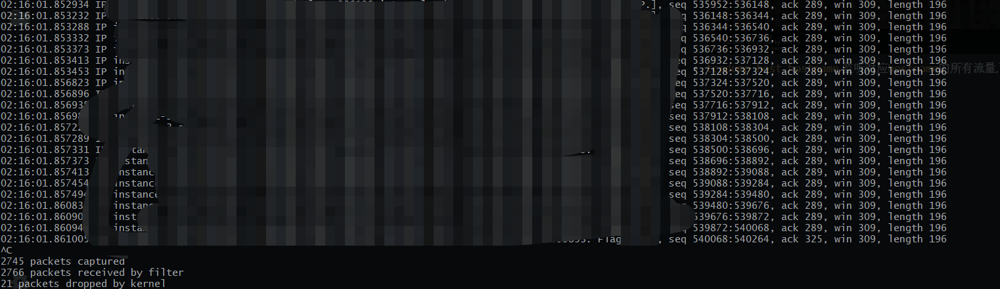
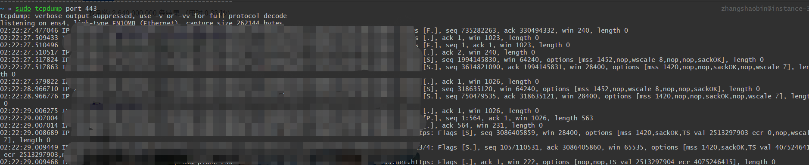
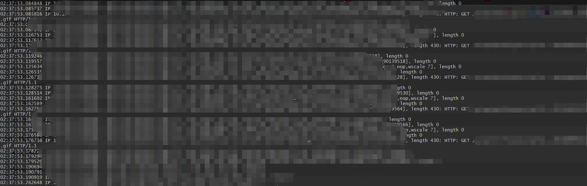

# TCPDump
## 使用方式
```
Usage: tcpdump [-aAbdDefhHIJKlLnNOpqStuUvxX#] [ -B size ] [ -c count ]
                [ -C file_size ] [ -E algo:secret ] [ -F file ] [ -G seconds ]
                [ -i interface ] [ -j tstamptype ] [ -M secret ] [ --number ]
                [ -Q in|out|inout ]
                [ -r file ] [ -s snaplen ] [ --time-stamp-precision precision ]
                [ --immediate-mode ] [ -T type ] [ --version ] [ -V file ]
                [ -w file ] [ -W filecount ] [ -y datalinktype ] [ -z postrotate-command ]
                [ -Z user ] [ expression ]
```
### 筛选方式
- -b : buffer_size 抓包的大小。
- -c : 指定要抓取的包数量。
- -F : 指定内含表达方式的文件。
## 筛选类型 
- -i : interface,指定`tcpdump`需要监听的网络接口。  
  + 若未指定该选项，将从系统接口列表中搜寻编号最小的已配置好的接口(不包括loopback接口，要抓取loopback接口使用tcpdump -i lo)。
  + 一旦找到第一个符合条件的接口，搜寻马上结束。可以使用'any'关键字表示所有网络接口。
## 输出

### 常用的使用方式
- `tcpdump -i interface`  监听对应网卡的流量
  
  
- `tcpdump host hostname` 监听对应`hostname`的所有流量,可以使用 `src`|`dst`指定方向
  
- `tcpdump port portNumber` 监听对应端口的流量
  
- `tcpdump -n -s0 'tcp && dst port 80'` 抓http的包
  
### 参考
[tcpdump](http://www.tcpdump.org/)  
[Linux tcpdump命令](https://www.runoob.com/linux/linux-comm-tcpdump.html)  
[tcpdump使用技巧](https://linuxwiki.github.io/NetTools/tcpdump.html)  
[超级详细Tcpdump 的用法](https://www.cnblogs.com/maifengqiang/p/3863168.html)  
[抓包工具tcpdump用法说明](https://www.cnblogs.com/f-ck-need-u/p/7064286.html)  
