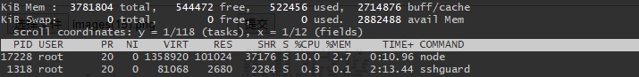
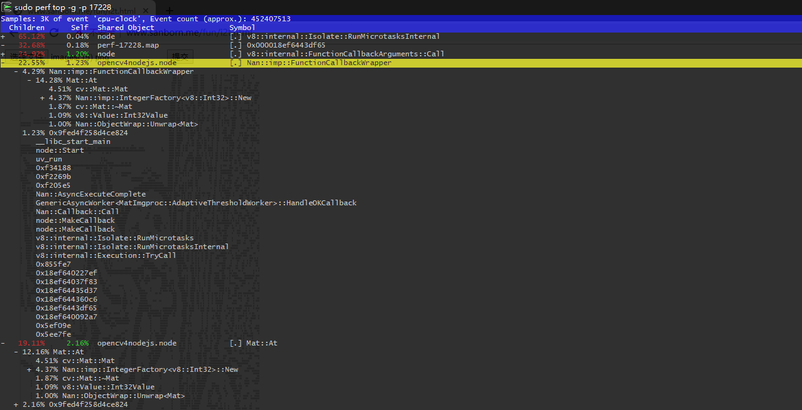

# 使用`perf`定位 `Node.js` `CPU`占用性能问题
    Perf 是用来进行软件性能分析的工具。

    通过它，应用程序可以利用 PMU，tracepoint 和内核中的特殊计数器来进行性能统计。它不但可以分析指定应用程序的性能问题 (per thread)，也可以用来分析内核的性能问题，当然也可以同时分析应用代码和内核，从而全面理解应用程序中的性能瓶颈。
## Install 
```
apt-get install linux-tools-common linux-tools-generic linux-tools-`uname -r`
```
<!--more-->
## 查看
1. 首先我们查看对应CPU占用高的`Node.js` 服务对应的`PID`
   
2. 取出对应的PID 使用  `perf top -g -p ${PID}`
3. 查看调用的函数
   

然后我们就可以具体事件具体分析
## REF
[perf -- Linux下的系统性能调优工具](https://www.ibm.com/developerworks/cn/linux/l-cn-perf1/index.html)  
[系统级性能分析工具 — Perf ](https://blog.csdn.net/zhangskd/article/details/37902159)  
[在Linux下做性能分析3：perf](https://zhuanlan.zhihu.com/p/22194920)  
[Installing and Using Perf in Ubuntu and CentOS](https://www.fosslinux.com/7069/installing-and-using-perf-in-ubuntu-and-centos.htm)
