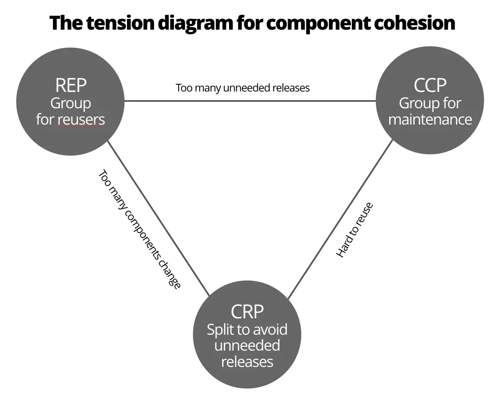
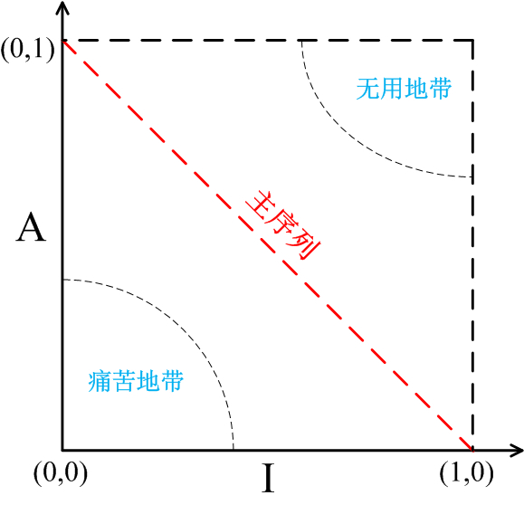

# 组件
## 组件聚合

对于大部分应用程序来说，可维护性大于可复用性，但是再项目的演变过程中会根据时间不断调整。    
> 例如: 在项目初期`CCP`原则会比`REP`原则更加重要
<!--more-->
### REP 复用/发布 等同原则
    软件服用的最小粒度应等同于其发布的最小粒度

1. 必须要求该组件的开发由某种发布流程来驱动
2. 必须有明确的发布版本号
3. 组件中的类与模块必须紧密相关
4. 一个组件中包含的类与模块还应该是可以同时发布的

### CCP 共同闭包原则
    我们应该将那些会同时修改的，并且为相同目的而修改的类放到同一个组件中，而将不会同时修改，并且不会为了相同目的而修改的类放到不同的组件中
简而言之就是:  一个组件不应该同时存在多个变更原因，`SRP/单一职责`的组件版

### CRP 共同复用原则
    不要强迫一个组件的用户依赖他们不需要的东西
1. 将经常共同复用的类和模块放在同一个组件中
2. 不是紧密相连的类不应该放在同一个组件里
3. 不要依赖不需要用到的东西 `ISP/接口隔离原则`的组件版

## 组件耦合
### 无依赖环原则(ADP)
    组件的依赖关系图中不应该出现环

#### 问题
当你的代码依赖于某个组件之后不能正常工作，但是这个组件再没有通知上游的情况下修改了。
> 一般来说是沟通和设计的问题： 
> 1. 未能通知所属依赖相关的人员或者团队，
> 2. 违反了设计原则

#### 解决
1. 每周构建： 但是随着项目的增长，构建所消耗的时间越来越长
2. 无依赖环原则： 将项目划分为一些可以单独发布的组件，这些组件可以由一个团队或者单独的人员负责。组件以版本的形式发布。
3. 依赖反转(DIP)

### 稳定依赖原则(SDP)
    依赖关系必须要指向更稳定的方向
任何一个我们预期会经常变更的组件都不应该被一个难于修改的组件所依赖，否则这个多变的组件也会变得非常难以被修改

#### 稳定性
    独立且被依赖的组件具有稳定性
#### 稳定性指标
- *Fan-in*: 入项依赖， 组件 *外部依赖于组件内部* 的数量
- *Fan-out*: 出项依赖，组件内部依赖于组件外部的数量
- *I*: 不稳定性 `Fan-out/(Fan-in + Fan-out)`。
  - 取值范围 `[0,1]`
  - `I = 0` 最稳定
  - `I = 1` 最不稳定

### 稳定抽象(SAP)
    一个组建的抽象化成都应该与其稳定性一致

1. 稳定的组件同时应该是抽象的
2. 不稳定的组件应该包含其实现的具体代码  
 
代表系统高阶策略的组件应该放在稳定组件中` (I = 0)` , 而不稳定组件` (I = 1) `应该只包含我们想要快速和方便修改的部分。

#### 抽象化程度
- *Nc*: 组件中的类的数量
- *Na*: 组件中抽象类和接口类的数量
- *A*: 抽象程度: `A = Na ➗ Nc`
  - *A* 取值范围: [0,1]
  - 0: 组件中没有任何抽象类
  - 1: 组件中只有抽象类

* 痛苦区  
  抽象度低`(A = 0)`，且十分稳定`(I = 0)`[有很多外部依赖]
* 无用区  
  组件高度抽象，且没有被其他外部所依赖。